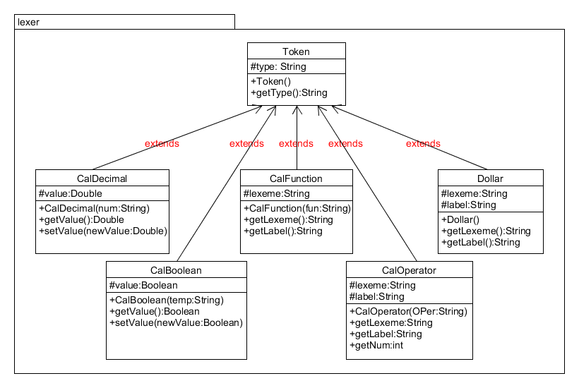
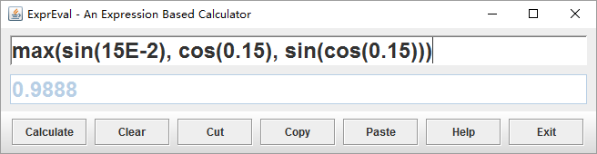
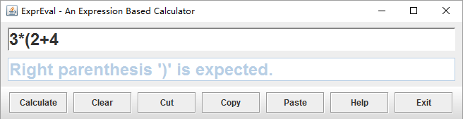

# ExprEval

## 项目介绍
本项目实现的是一个基于表达式的计算器，它包含加减乘除，关系运算，预定义函数等绝大部分基本运算操作。实现的基本原理就是先用词法分析器lexer对读入的表达式字符串划分为几个预定义的词法单元，然后使用parser对词法单元做语法分析并执行语义动作，最后得出结果或者抛出相应的异常。算法使用算符优先关系分析法。      
项目代码包含详见的注释，doc文件夹下存放了使用javadoc生成的项目架构文档。       
**项目具体介绍文档在`documents/design.docx`**        
开发语言及工具： Java， Eclipse      

## 项目截图

*lexer的UML图*

*程序正常运行截图*

*抛出异常截图*

**2015-12-20**

